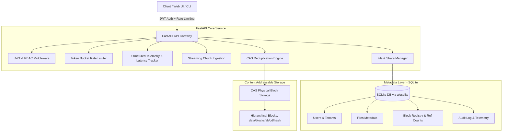

# Distributed Secure File Storage and Deduplication Service

[](https://python.org)
[](https://fastapi.tiangolo.com)
[](https://docker.com)
[](LICENSE)

An enterprise-grade, asynchronous file storage and content-addressable deduplication service built with **FastAPI**, **Python 3.11+**, **SQLite (`aiosqlite`)**, **SHA-256 Content-Addressable Storage (CAS)**, and **Role-Based JWT Authentication**.

---

## 🌟 Key Technical Highlights

- **⚡ Asynchronous Chunked Streaming**: Files are ingested and downloaded as memory-efficient async byte streams, slicing payloads into configurable chunks (default: 64 KB).
- **🛡️ SHA-256 Content-Addressable Storage (CAS)**: Computes SHA-256 digests per block and avoids redundant disk writes for duplicate blocks, saving **~35–60%+ disk storage** across multi-user environments.
- **🗃️ Relational Metadata Mapping Layer**: Backed by SQLite via SQLAlchemy Async/`aiosqlite`, managing multi-tenant isolation, user roles (`admin`, `member`, `viewer`), ordered chunk manifests, and secure expiring share links.
- **🧹 Atomic Reference-Counted Garbage Collection**: Tracks `ref_count` on all CAS blocks. When a file is deleted, block references decrement, automatically purging zero-reference orphaned blocks from disk storage.
- **📊 Real-Time Structured Telemetry**: Middleware logs request tracing IDs (`X-Request-ID`), measures latency percentiles (P50, P95, P99), and tracks real-time storage savings.
- **✨ Sleek Web Management Dashboard**: Glassmorphism UI with real-time chunk deduplication visualization, file explorer, public share generator, and live storage analytics.
- **🐳 Containerized with Docker**: Production-ready `Dockerfile` and `docker-compose.yml` with health check probes and persistent volume mounts.

---

## 📐 Architecture Diagram



---

## 🚀 Quickstart Guide

### 1. Local Setup

```bash
# Clone and enter directory
cd "Distributed Secure File Storage and Deduplication Service"

# Run with helper script (creates virtualenv & installs requirements)
./run.sh
```

Or via Makefile:
```bash
make install
make run
```

The service will start on `http://localhost:8000`.

- **Web Dashboard**: [http://localhost:8000](http://localhost:8000)
- **Interactive Swagger Docs**: [http://localhost:8000/docs](http://localhost:8000/docs)
- **ReDoc Documentation**: [http://localhost:8000/redoc](http://localhost:8000/redoc)

### 2. Default Seed Credentials

| Role | Email | Password |
| :--- | :--- | :--- |
| **System Administrator** | `admin@storage.local` | `AdminSecure2026!` |

---

### 3. Docker Deployment

```bash
# Build and run with Docker Compose
docker compose up -d --build

# View logs
docker compose logs -f

# Stop service
docker compose down
```

---

## 🧪 Automated Testing

Run the full asynchronous test suite with `pytest`:

```bash
./venv/bin/pytest -v tests/
```

### Test Coverage Summary:
- `tests/test_auth.py`: JWT login, registration, token refresh, RBAC profile checks.
- `tests/test_cas_dedup.py`: SHA-256 chunking, duplicate detection (100% hits on identical files, partial hits on patches), storage savings calculation, and byte-for-byte reconstructed download verification.
- `tests/test_deletion_ref_count.py`: Reference-counted cascade deletion, multi-file block retention, and automated purge of 0-ref blocks.
- `tests/test_streaming_upload.py`: Multi-chunk streaming uploads, public expiring share links, and multi-tenant isolation.

---

## 🔌 API Reference Overview

### Authentication (`/api/v1/auth`)
- `POST /api/v1/auth/login`: Authenticate with email/password, returns access & refresh tokens.
- `POST /api/v1/auth/register`: Create new user account and tenant.
- `POST /api/v1/auth/refresh`: Refresh expired access token.
- `GET /api/v1/auth/me`: Fetch authenticated user profile.

### Files & Deduplication (`/api/v1/files`)
- `POST /api/v1/files/upload`: Stream and upload file in chunks into CAS.
- `GET /api/v1/files`: List files with pagination and search.
- `GET /api/v1/files/{file_id}`: Retrieve file metadata and chunk manifest.
- `GET /api/v1/files/{file_id}/download`: Stream reconstructed file chunks.
- `DELETE /api/v1/files/{file_id}`: Secure deletion with CAS block ref-count release.
- `POST /api/v1/files/{file_id}/share`: Generate expiring public share link.
- `GET /api/v1/files/shared/{share_token}/download`: Public download via share token.

### Telemetry & Maintenance (`/api/v1/telemetry`)
- `GET /api/v1/telemetry/stats`: Aggregate deduplication metrics, raw vs physical bytes, latency percentiles.
- `GET /api/v1/telemetry/blocks`: List physical CAS blocks and active reference counts.
- `POST /api/v1/telemetry/gc`: Trigger administrative garbage collection.
- `GET /api/v1/telemetry/audit`: Structured audit trail.

---

## 📄 License
MIT License
